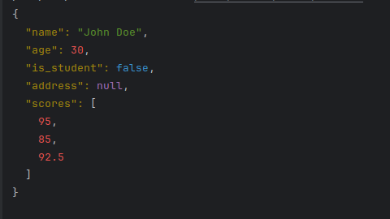

# PrettifyJson

`prettify_json` is a powerful command-line tool designed to enhance the readability of JSON data. Whether you're working with JSON files, strings, or data streamed from the web, `prettify_json` will format it in a clean, colorful, and human-friendly way.

## Features

- **Readability**: Formats JSON data for easier reading.
- **Flexibility**: Accepts input from files, strings, or standard input.
- **Colorful Output**: Adds colors to the JSON keys, strings, numbers, and more for better visual distinction.

## Dependencies

- Ruby (version 2.7.0 or higher)

## Installation

Add this line to your application's Gemfile:

```ruby
gem 'prettify_json'
```

And then execute:

```sh
$ bundle install
```

Or install it yourself as:

```sh
$ gem install prettify_json
```

## Usage

### Ruby Code
```ruby
require 'prettify_json'

# Sample JSON string
json_string = '{"name": "John Doe", "age": 30, "is_student": false, "address": null, "scores": [95, 85, 92.5]}'

# Create an instance of JsonPrettifier
prettifier = PrettifyJson::JsonPrettifier.new(json_string)

# Get the prettified JSON
prettified_json = prettifier.pretty_print

# Output the prettified JSON
puts prettified_json

```


### From a File

Prettify JSON data from a file:

```sh
$ prettify_json -f path/to/your/file.json
```

### From a String

Prettify JSON data from a string:

```sh
$ prettify_json -s '{"key": "value"}'
```

### From Standard Input

Prettify JSON data from standard input:

```sh
$ echo '{"key": "value"}' | prettify_json -
```

### From a Web API

Fetch and prettify JSON data from a web API:

```sh
$ curl -s https://api.restful-api.dev/objects | prettify_json -
```

## Examples

### Example 1: Prettifying a JSON File

```sh
$ prettify_json -f sample.json

{
  "name": "John Doe",
  "age": 30,
  "city": "New York"
}
```

### Example 2: Prettifying a JSON String

```sh
$ prettify_json -s '{"name": "John Doe", "age": 30, "city": "New York"}'

{
  "name": "John Doe",
  "age": 30,
  "city": "New York"
}
```

### Example 3: Prettifying JSON from a REST API

```sh
$ curl -s https://api.restful-api.dev/objects | prettify_json -

[
  {
    "id": 1,
    "name": "Object 1",
    "data": {
      "value": "Sample data"
    }
  },
  {
    "id": 2,
    "name": "Object 2",
    "data": {
      "value": "More sample data"
    }
  }
]
```

## Development

After checking out the repo, run `bin/setup` to install dependencies. Then, run `rake spec` to run the tests. You can also run `bin/console` for an interactive prompt that will allow you to experiment.

To install this gem onto your local machine, run `bundle exec rake install`. To release a new version, update the version number in `lib/prettify_json/version.rb`, and then run `bundle exec rake release`, which will create a git tag for the version, push git commits and the created tag, and push the `.gem` file to [rubygems.org](https://rubygems.org).

## Contributing

Bug reports and pull requests are welcome on GitHub at https://github.com/talaatmagdyx/prettify_json. This project is intended to be a safe, welcoming space for collaboration, and contributors are expected to adhere to the [code of conduct](https://github.com/talaatmagdyx/prettify_json/blob/master/CODE_OF_CONDUCT.md).

## Reporting Bugs / Feature Requests

If you encounter any bugs or have suggestions for new features, please [open an issue on GitHub](https://github.com/talaatmagdyx/prettify_json/issues). Your feedback is valuable and helps improve the quality of the gem.

## License

The gem is available as open source under the terms of the [MIT License](https://opensource.org/licenses/MIT).

## Code of Conduct

Everyone interacting in the PrettifyJson project's codebases, issue trackers, chat rooms, and mailing lists is expected to follow the [code of conduct](https://github.com/talaatmagdyx/prettify_json/blob/master/CODE_OF_CONDUCT.md).
